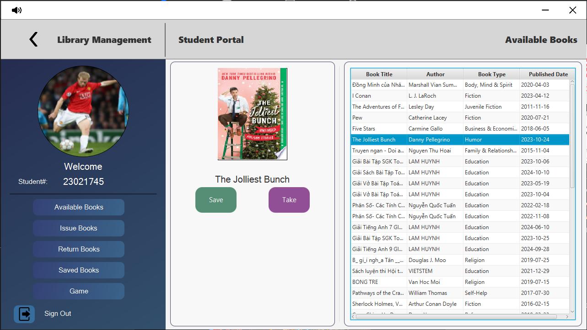
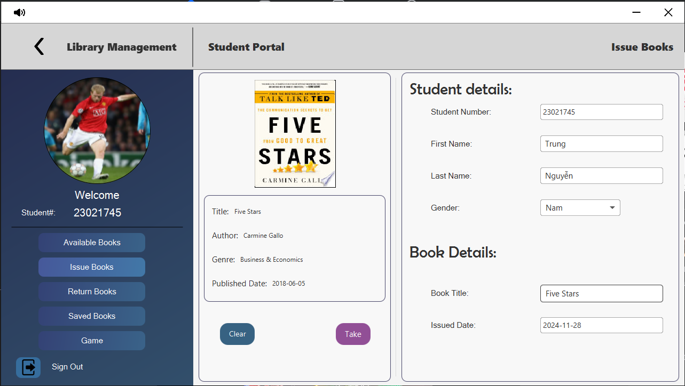
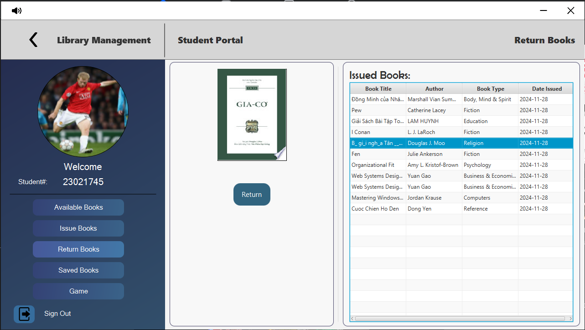
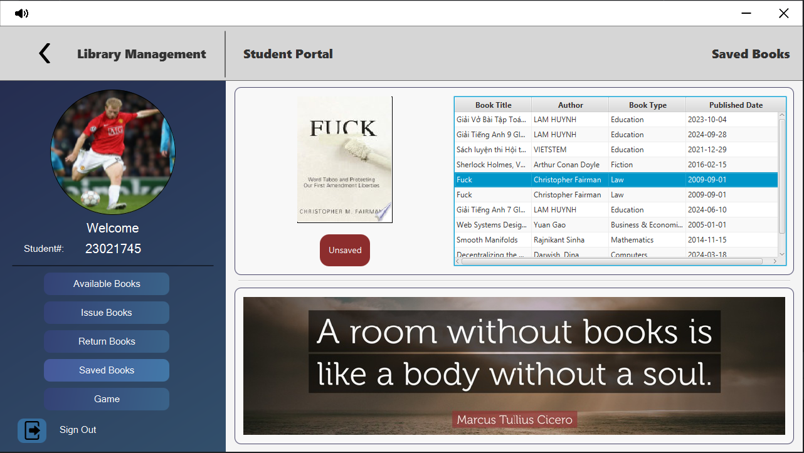
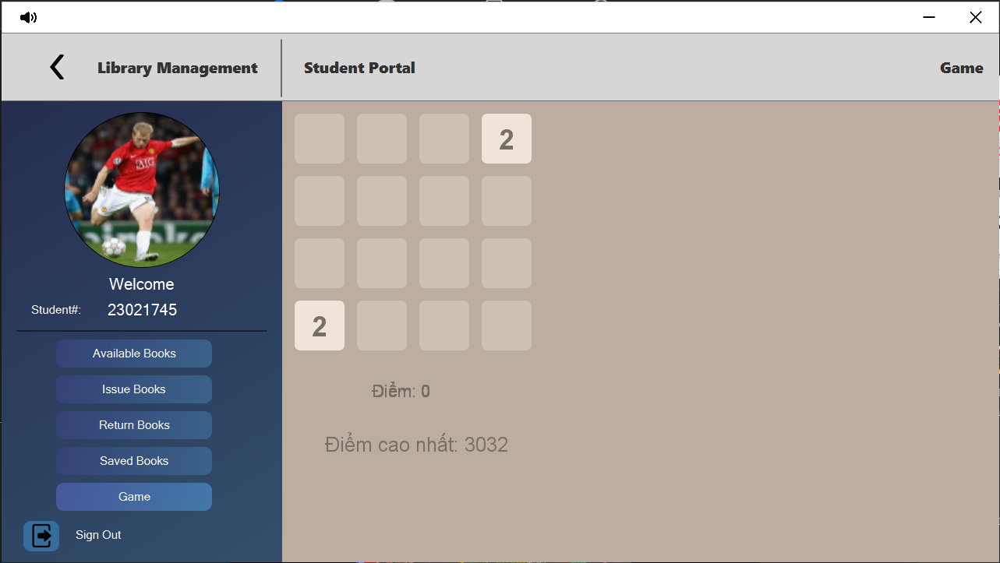
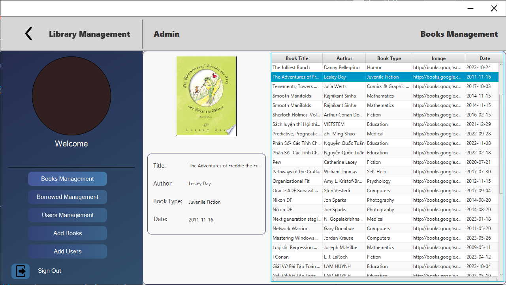
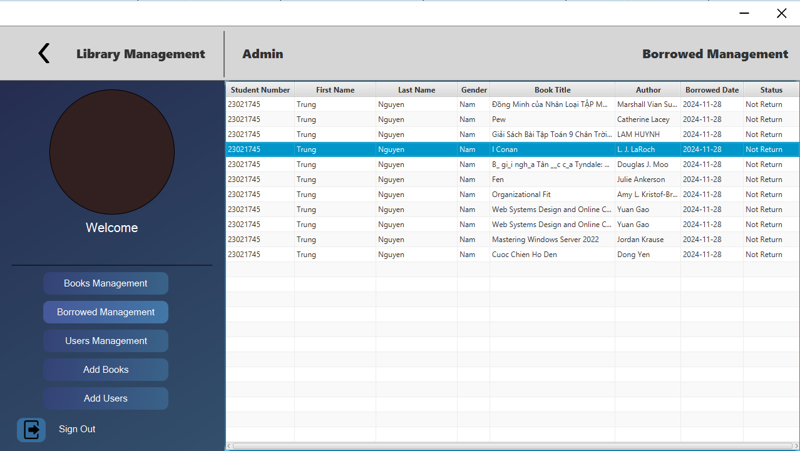
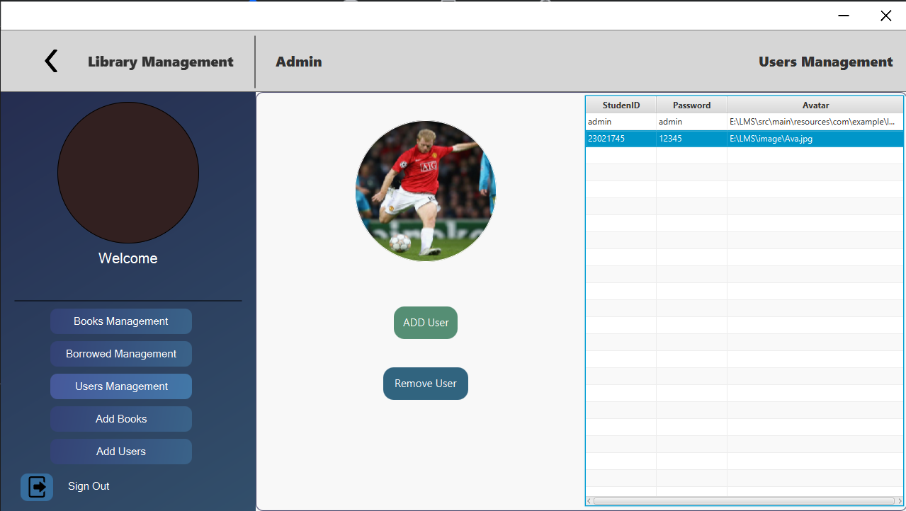
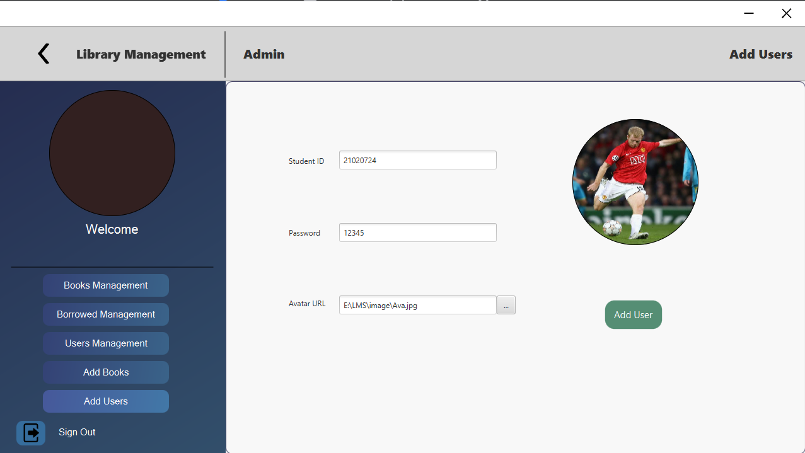
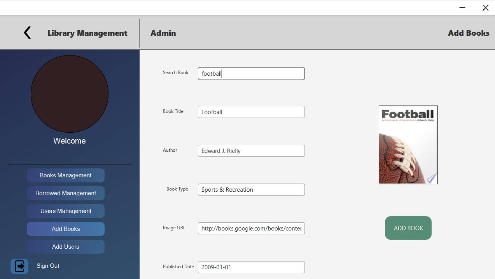

<div align="center">
    
</div>

# The Farmer  Quản lý thư viện
# ♠️ Contributer:
1. Nguyễn Văn Trung - 23021745
2. Nguyễn Trung Dũng - 21020724
3. Phạm Minh Quang - 21020601
# ♦️ Mô tả:
Phần mềm quản lý thư viện với giao diện thân thiện và dễ sử dụng, giúp cho việc quản lý thư viện trở nên dễ dàng hơn . Thay vì sử dụng bảng ghi chép thông thường, ở đây ta sử dụng công nghệ để làm điều đó.

Ứng dụng được viết bằng ngôn ngữ Java, CSS, MySQL và tích hợp thư viện JavaFX.

# 🚀 Chức năng:
### 1. User:
  - Tìm kiếm sách theo tên.
  - Nhạc.
  - Mượn và trả sách.
  - Lưu sách.
  - Chọn hình đại diện.
  - Chơi 2048.
  
    
### 2. Admin:
  - Kiểm tra sách.
  - Kiểm tra người mượn, danh sách mượn.
  - Kiểm tra trạng thái mượn/ trả.
  - Thông tin người dùng, thêm/xóa người dùng.
  - Thêm sách ( thêm từ Google books API)
#  Ngôn ngữ phát triển 
 <p align="center">
  <a href=""></a>
</p>
<table align="center">
  <tr>
    <!-- Java -->
    <td>
      <a href="https://www.java.com" target="_blank" rel="noreferrer">
        
      </a>
    </td>
    <td width="30"></td>
    <!-- CSS -->
    <td>
      <a href="https://www.w3schools.com/css/" target="_blank" rel="noreferrer">
        
      </a>
    </td>
    <td width="30"></td>
    <!-- MySQL -->
    <td>
      <a href="https://www.mysql.com/" target="_blank" rel="noreferrer">
        
      </a>
    </td>
  </tr>
</table>


<p align="center">
  
  &nbsp;&nbsp;&nbsp;&nbsp;&nbsp;
  
  &nbsp;&nbsp;&nbsp;&nbsp;&nbsp;&nbsp;
  
</p>

# ⚀⚁⚂⚃⚄⚅ Hướng dẫn cài đặt
1. Yêu cầu IDE cho JAVA, CSS và MySQL.
2.  Clone dự án về máy tính.
3.  Mở MySQL Workbench, tạo MySQL Connections mới, tạo tệp Query Tab mới. Copy nội dung file lms.txt để tạo database cho dự án.
4.  Mở IDE Intellij, cài hết thư viện mở rộng.
5.  Đổi đường dẫn trong file Database.java thành localhost của máy mình.
6.  Chạy LibraryManagement.java và tận hưởng 🔥.

# 🃏 Hướng dẫn sử dụng:
### 1. User:
#### a. Đăng ký và đăng nhập
  - Nhập tên đăng nhập và mật khẩu rồi ấn đăng nhập để đăng nhập ứng dụng nếu đã có tài khoản trước.
  - Nếu chưa có tài khoản, chọn Create new account để tạo tài khoản mới
    + Điền tên đăng nhập và mật khẩu để đăng ký tài khoản.
    + Sau khi hiện bảng thông tin " Tạo tài khoản thành công", người dùng tiến hành đăng nhập như bình thường.
    + Nếu quên mật khẩu, liên hệ Admin để lấy lại mật khẩu.
#### b. Chức năng của người dùng
  - **Dashboard**: hiển thị thông tin người dùng, xem các sách hiện có, có thể lưu và mượn luôn ở trang Dashboard.
  -  **Issue Books**: mượn sách, điền thông tin của người dùng để mượn.
  -  **Return Books**: hiển thị danh sách đang mượn, và nút trả sách để người dùng trả.
  -  **Saved Books**: hiển thị danh sách sách đã lưu.
#### c. 2048
  - Sử dụng các phím mũi tên để đạt được 2048 .

### 2. Admin:
#### a. Đăng nhập 
  - Đăng nhập bằng tài khoản admin có sẵn.

#### b. Chức năng của Admin
  - **Books Management**: hiển thị thông tin các sách có sẵn.
  -  **Borrowed Management**: quản lý mượn sách, ở trong đó hiển thị mã sinh viên, tên, loại sách, ngày mượn, trạng thái mượn/trả.
  -  **Users Management**: hiển thị danh sách người dùng, tên đăng nhập và mật khẩu.
  -  **Add Books**: thêm sách từ Google Books API.
  -  **Add Users**: thêm người dùng, mã sinh viên ( tên đăng nhập), mật khẩu và avatar.

# 🦖Hình ảnh chức năng và dự án:
## 1. Giao diện người dùng:
<br> <br>

<br> <br>
## 2. Chức năng người dùng:
### a. Available Books:


### b. Issue Books:


### c. Return Books:


### d. Saved Books:


### e. Game:


## 3. Chức năng Admin:
### a. Books Management:


### b. Borrowed Books Management:


### c. Users Management:


#### Add / Reomve Users:


### d. Add Books: ( Google Books API )


<div align="center"> 

# 📧Liên hệ

<div align="center">
  <a>
    <a href="https://discord.gg/Cp2VmVn6" target="_blank">
    
  </a>

```bash

   ____ _           _   _                   
  / ___| | __ _  __| | | |_ ___             
 | |  _| |/ _` |/ _` | | __/ _ \            
 | |_| | | (_| | (_| | | || (_) |           
  \____|_|\__,_|\__,_|  \__\___/            
  ___  ___  ___                             
 / __|/ _ \/ _ \                            
 \__ \  __/  __/                            
 |___/\___|\___|      _                   _ 
  _   _  ___  _   _  | |__   ___ _ __ ___| |
 | | | |/ _ \| | | | | '_ \ / _ \ '__/ _ \ |
 | |_| | (_) | |_| | | | | |  __/ | |  __/_|
  \__, |\___/ \__,_| |_| |_|\___|_|  \___(_)
  |___/                                     


```
<div align="center">
  
</div>


